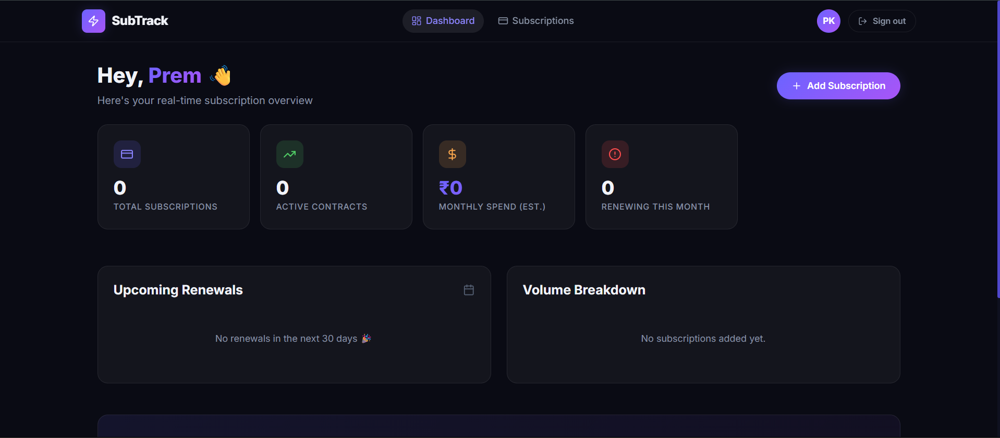
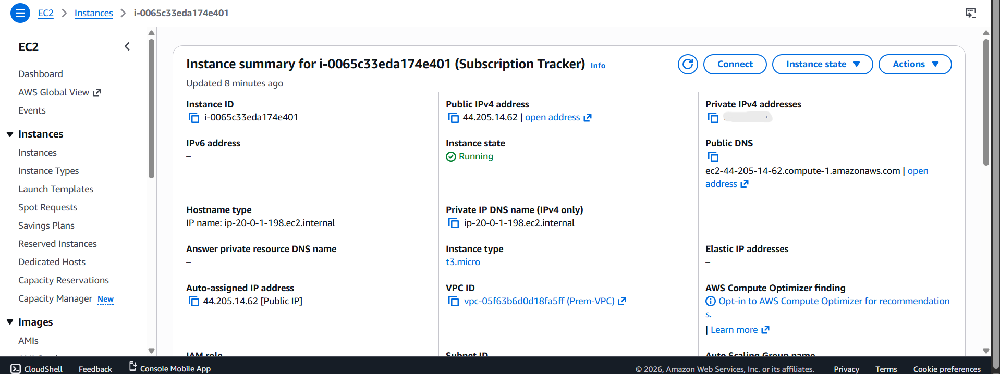
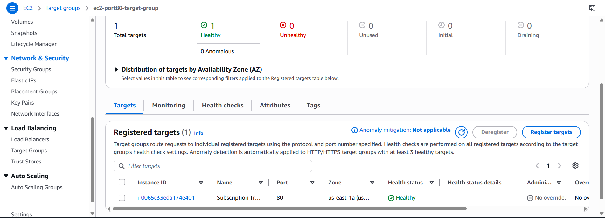
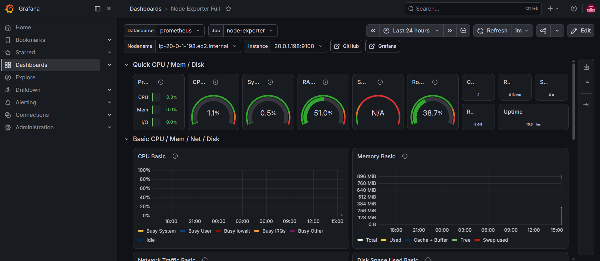
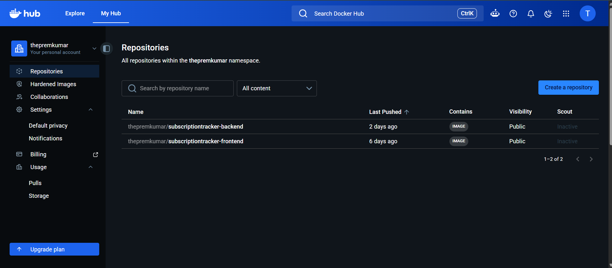

# 🚀 Subscription Tracker — End-to-End DevOps Pipeline on AWS

A production-grade DevOps implementation of a full-stack Subscription Tracker application, demonstrating the complete DevOps lifecycle from containerization to monitoring.

## 🏗️ Architecture Overview

```
Internet
    ↓
ALB (Application Load Balancer)
    ↓
EC2 Instance (Docker Containers)
    ├── Frontend (React + Nginx) :80
    └── Backend (Node.js/Express) :3000
            ↓
        MongoDB Atlas (Cloud DB)

Monitoring EC2
    ├── Prometheus :9090
    ├── Grafana :3000
    └── Alertmanager :9093
```

## 🛠️ Tech Stack

| Category | Tools |
|----------|-------|
| Application | Node.js, Express.js, React.js, MongoDB |
| Containerization | Docker, Docker Compose |
| Infrastructure | AWS (EC2, VPC, ALB, SG), Terraform |
| Configuration Management | Ansible |
| CI/CD | Jenkins, SonarQube Cloud |
| Monitoring | Prometheus, Grafana, Alertmanager |
| Registry | DockerHub |

## 📁 Project Structure

```
Subscription-Tracker/
├── backend/               # Node.js/Express API
│   └── Dockerfile
├── frontend/              # React/Vite application
│   ├── Dockerfile
│   └── nginx.conf
├── terraform/             # AWS Infrastructure as Code
│   ├── main.tf
│   ├── variables.tf
│   ├── outputs.tf
│   ├── provider.tf
│   └── userdata.sh
├── ansible/               # Configuration Management
│   ├── playbook.yml
│   ├── inventory.ini
│   ├── ansible.cfg
│   └── roles/
│       └── docker/
│           ├── tasks/main.yml
│           └── files/docker-compose.yml
├── docker-compose.yml     # Local development
├── Jenkinsfile            # CI/CD Pipeline
└── sonar-project.properties
```

## 🔄 CI/CD Pipeline Flow

```
git push → GitHub
    ↓
Jenkins (webhook trigger)
    ↓
SonarQube Code Quality Scan
    ↓
Quality Gate Check
    ↓
Docker Build (parallel frontend + backend)
    ↓
Docker Push to DockerHub
    ↓
Ansible Deploy to EC2
    ↓
App Live on AWS ALB
```

## 📊 Monitoring Stack

- **Node Exporter** — System metrics (CPU, Memory, Disk)
- **Prometheus** — Metrics collection and storage
- **Grafana** — Dashboard visualization
- **Alertmanager** — Email alerts on incidents

## 🚀 Phases Completed

- ✅ Phase 1: Full-stack application (Node.js + React + MongoDB)
- ✅ Phase 2: Dockerization with docker-compose
- ✅ Phase 3: AWS Infrastructure with Terraform
- ✅ Phase 4: Configuration Management with Ansible
- ✅ Phase 5: CI/CD Pipeline with Jenkins + SonarQube
- ✅ Phase 6: Monitoring with Prometheus + Grafana

## 🌐 Live URLs

- **Application:** http://public-application-alb-207256170.us-east-1.elb.amazonaws.com
- **Grafana:** http://monitoring-ip:3000
- **Prometheus:** http://monitoring-ip:9090

## 📸 Project Screenshots

Here are the screenshots showcasing the deployed application, AWS infrastructure, and monitoring setup:

### 1. Live Application


### 2. AWS EC2 Running Instances


### 3. AWS ALB (Application Load Balancer) Healthy Targets


### 4. Grafana Dashboard


### 5. Docker Hub Images


## 👤 Author

**Prem Kumar S**
- GitHub: [@ThePremkumar](https://github.com/ThePremkumar)